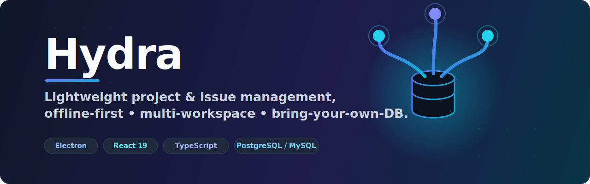
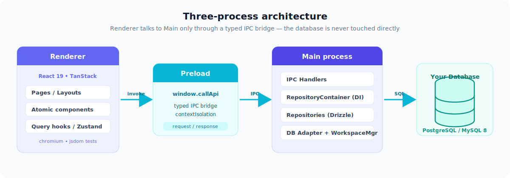
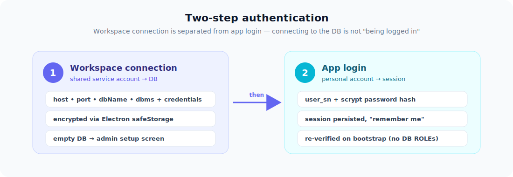
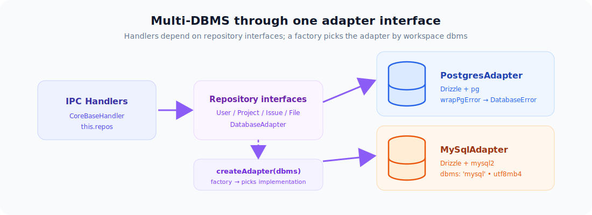

<p align="center">
  
</p>

<p align="center">
  <b>Lightweight, offline-first project &amp; issue management for your desktop — bring your own database.</b>
</p>

<p align="center">
  English · <a href="./README.md">한국어</a>
</p>

<p align="center">
  <a href="./LICENSE"></a>
  
  
  
  
  
  
  
  
</p>

<p align="center">
  <a href="#-quick-start">Quick Start</a> ·
  <a href="#-architecture">Architecture</a> ·
  <a href="#-authentication-two-step">Auth</a> ·
  <a href="#-database-postgresql--mysql-8">Database</a> ·
  <a href="#-features">Features</a> ·
  <a href="#-contributing">Contributing</a>
</p>

---

**Hydra** is an Electron desktop app for project/issue management. It's **offline-first**, **multi-workspace**, and **open source** — you connect **your own PostgreSQL or MySQL 8 database** instead of relying on someone else's cloud.

- **Tech** — Electron + React 19 + TypeScript · shadcn/ui + Tailwind CSS v4 · Zustand v5 · Drizzle ORM (PostgreSQL / MySQL 8) · TanStack Router/Table/Form · Tiptap · Recharts · i18next
- **Highlights** — offline-first · multi-workspace · bring-your-own-database · two-step auth

> 📖 Deeper design/ops docs live in [`wiki/`](./wiki). The architecture summary is in [`CLAUDE.md`](./CLAUDE.md).

## 🚀 Quick Start

**Requirements** — Node.js 20+ · pnpm 9+ · a PostgreSQL or MySQL 8.0+ database to connect to. For local dev, PostgreSQL can be started with `pnpm docker:up` (Docker Desktop required).

```bash
pnpm install            # 1. install dependencies
cp .env.example .env    # 2. copy env (drizzle CLI only — separate from app runtime)
pnpm docker:up          # 3. (optional) start local PostgreSQL
pnpm db:push            # 4. push Drizzle schema to the DB (local dev)
pnpm hot                # 5. run the Electron app in dev mode (hot reload)
```

On first launch a **workspace connection screen** appears. After connecting with DB credentials, an empty DB routes you to the **admin setup screen**. See [Getting Started](./wiki/Getting-Started.md) for the full flow.

## 🏗 Architecture

Hydra follows Electron's three-process model. The renderer never touches the database directly — every call crosses a **typed IPC bridge** into the main process, which owns all data access.

<p align="center">
  
</p>

- **Renderer** (`src/renderer/src/`) — React 19 UI in Atomic Design (atoms → molecules → organisms → templates → pages → layouts); server data via TanStack Query hooks, UI state via Zustand.
- **Preload** (`src/preload/`) — exposes `window.callApi` for typed, context-isolated IPC.
- **Main** (`src/main/`) — IPC handlers (`CoreBaseHandler`), a singleton `RepositoryContainer`, Drizzle repositories, the DB adapter, and the encrypted `WorkspaceManager`.

## 🔐 Authentication (two-step)

Hydra separates **workspace connection** from **app login** — connecting to the DB is *not* "being logged in".

<p align="center">
  
</p>

1. **Workspace connection** — connect to the DB with a shared service account (host/port/dbName/dbms + credentials), encrypted via Electron safeStorage.
2. **App login** — sign in with a personal account (`user_sn` + scrypt-hashed password + session).

Connecting to an empty DB shows the admin setup screen; the admin then creates members in-app (no DB ROLEs). Sessions are persisted via safeStorage ("remember me" extends expiry) and re-verified on bootstrap. See [Authentication](./wiki/Authentication.md).

## 🗄 Database (PostgreSQL / MySQL 8)

Choose the DBMS when adding a workspace. A single repository interface is backed by a per-DBMS adapter, selected by a factory at connect time.

<p align="center">
  
</p>

The runtime service account needs **DML privileges only** (no `ALL PRIVILEGES`). Migrations run automatically on connect; if the schema is current the migrator is skipped, so a DML-only account works.

<details>
<summary><b>Database setup &amp; privileges</b></summary>

```sql
-- MySQL 8 example
CREATE USER 'hydra_app'@'%' IDENTIFIED BY '<password>';
GRANT SELECT, INSERT, UPDATE, DELETE ON hydra.* TO 'hydra_app'@'%';
```

**On first connect and after an app upgrade** (when migrations are pending), connect once with a DDL-capable account (`CREATE, ALTER, INDEX, REFERENCES`). MySQL requires the `utf8mb4` charset.

> ⚠️ Never run `drizzle-kit push` against a MySQL workspace — use the generated migrations only (collation is owned by schema custom types).

See [Database & Multi-DBMS](./wiki/Database-and-Multi-DBMS.md) for the full architecture.

</details>

## ✨ Features

Issue/project management, milestones, labels, checklists (Tasks), issue relations (blocks / is_blocked_by / relates_to), threaded comments, in-app notifications, activity-log timeline, kanban board, Slack/GitHub integrations, a Tiptap rich-text editor, and dark mode.

<details>
<summary><b>Feature breakdown</b></summary>

| Area | What you get |
|------|--------------|
| **Projects & Issues** | Full CRUD, project members, per-project settings |
| **Milestones & Labels** | Scheduling and classification across issues |
| **Tasks** | Per-issue checklist items |
| **Issue Relations** | `blocks` / `is_blocked_by` / `relates_to` between issues |
| **Comments** | Threaded comments per issue with full CRUD |
| **Notifications** | In-app notifications with unread-count badge |
| **Integrations** | Slack webhook (with test-send) and GitHub token |
| **Rich Text** | Tiptap editor for descriptions and comments |
| **Workspaces** | Multiple encrypted workspaces, BYO PostgreSQL/MySQL |
| **UX** | Dark mode, i18n (i18next), resizable panels, toasts |

See [Features](./wiki/Features.md) for the complete list.

</details>

## 🧰 Commands

<details>
<summary><b>All pnpm scripts</b></summary>

| Command | Description |
|---------|-------------|
| `pnpm hot` / `pnpm dev` | dev server (with / without hot reload) |
| `pnpm build` | type-check + production build |
| `pnpm typecheck` | type-check (`:node` / `:web`) |
| `pnpm lint` / `pnpm format` | Biome lint / format |
| `pnpm test` | Vitest (`:watch` / `:coverage`) |
| `pnpm docker:up` / `pnpm docker:down` | local PostgreSQL container |
| `pnpm db:push` / `pnpm db:generate` / `pnpm db:generate:mysql` | Drizzle schema push / migration generate (PG / MySQL) |
| `pnpm db:studio` | Drizzle Studio (DB GUI) |
| `pnpm storybook` / `pnpm build-storybook` | Storybook dev / build |
| `pnpm package` / `pnpm make` | Electron Forge package / installer |

</details>

## 📂 Project structure

- `src/main/` — Electron main process (IPC handlers, DB adapters/repositories, workspace)
- `src/preload/` — typed IPC bridge (`window.callApi`)
- `src/renderer/src/` — React renderer (Atomic Design)
- `docs/` — design/backlog/plan docs · `wiki/` — user/dev wiki · `drizzle/` — generated migrations (PG/MySQL)

## 🌿 Branching model

- The base branch for active development is **`main`**.
- Past lines (the old `main`, `ui-v2`, `develop`, `docs`) are archived under the **`legacy/*`** namespace for history.
- Working-branch convention: `feature/*`, `bugfix/*`, `hotfix/*`. See [Branching & Releases](./wiki/Branching-and-Releases.md).

## 🤝 Contributing

PRs are welcome! See [`CONTRIBUTING.en.md`](./CONTRIBUTING.en.md) and the [`CODE_OF_CONDUCT.en.md`](./CODE_OF_CONDUCT.en.md). Code style and conventions are detailed in the [Contributing wiki](./wiki/Contributing.md) and [`CLAUDE.md`](./CLAUDE.md).

## 📄 License

[MIT](./LICENSE) © jujoycode

<p align="center">
  <sub>Built with Electron · React 19 · Drizzle ORM — your data stays in your database.</sub>
</p>
