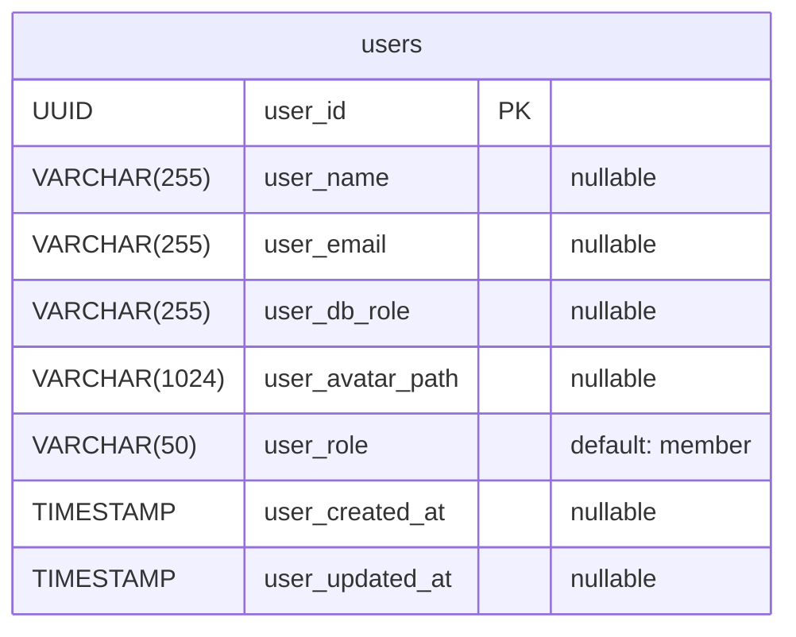
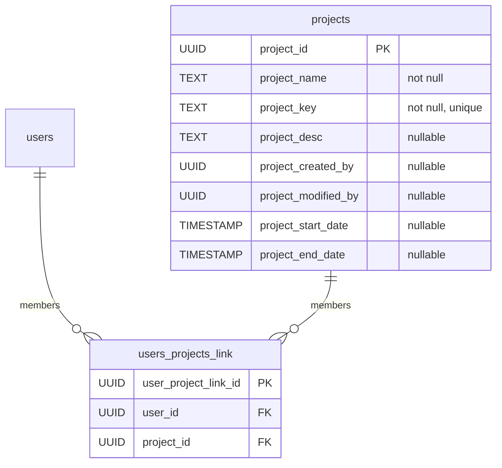
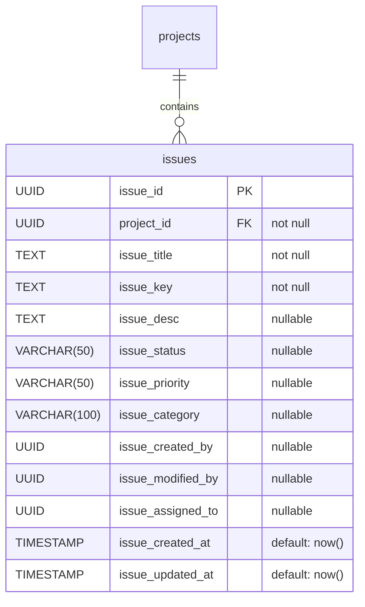
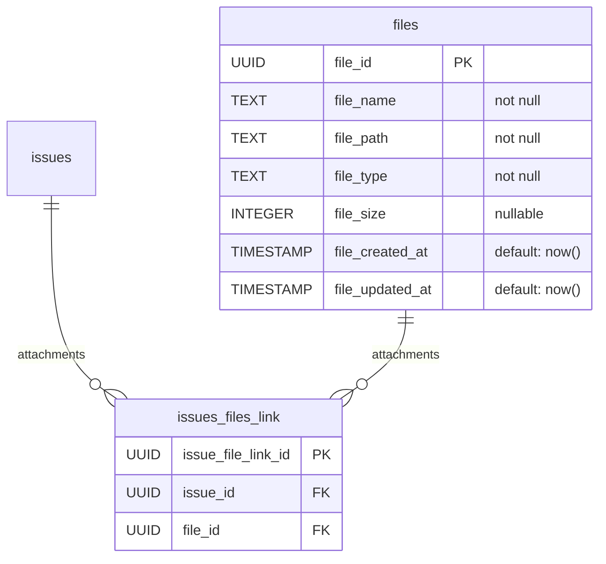
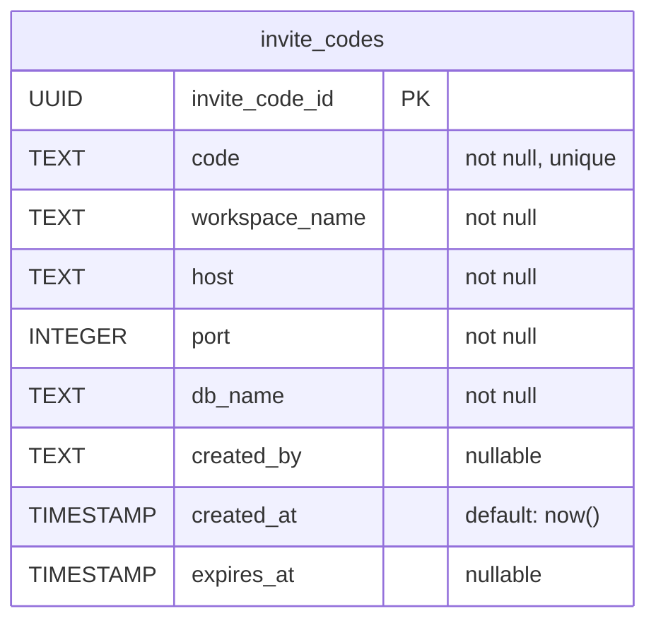

# Hydra ERD
> Based on Drizzle ORM schema (`src/main/core/database/schema/drizzle/schema.ts`)

- [Auth](#auth)
- [Project](#project)
- [Issue](#issue)
- [File](#file)
- [Invite](#invite)

## Auth

### `users`
사용자 정보를 저장합니다. DB 연결 시 PostgreSQL ROLE과 매핑됩니다.

**Properties**
  - `user_id`: UUID 기본키
  - `user_name`: 사용자 이름
  - `user_email`: 이메일
  - `user_db_role`: PostgreSQL 데이터베이스 역할명
  - `user_avatar_path`: 아바타 이미지 경로
  - `user_role`: 앱 내 역할 (admin / member)
  - `user_created_at`: 생성일시
  - `user_updated_at`: 수정일시

## Project

### `projects`
[users](#users)들이 참여하여 [issues](#issue)들을 관리합니다.

**Properties**
  - `project_id`: UUID 기본키
  - `project_name`: 프로젝트명
  - `project_key`: 프로젝트 고유 키 (3-5자 대문자, unique)
  - `project_desc`: 프로젝트 설명
  - `project_created_by`: 생성자 UUID
  - `project_modified_by`: 수정자 UUID
  - `project_start_date`: 시작일
  - `project_end_date`: 종료일

### `users_projects_link`
사용자-프로젝트 다대다 연결 테이블입니다.

**Properties**
  - `user_project_link_id`: UUID 기본키
  - `user_id`: 사용자 FK → users.user_id
  - `project_id`: 프로젝트 FK → projects.project_id

## Issue

### `issues`
[projects](#project)에 속한 이슈들을 관리합니다.

**Properties**
  - `issue_id`: UUID 기본키
  - `project_id`: 프로젝트 FK → projects.project_id
  - `issue_title`: 이슈 제목
  - `issue_key`: 이슈 키 (예: PROJ-1)
  - `issue_desc`: 이슈 설명
  - `issue_status`: 상태 (backlog, todo, in_progress, review, done)
  - `issue_priority`: 우선순위 (urgent, high, medium, low, none)
  - `issue_category`: 카테고리 (bug, feature, improvement, task)
  - `issue_created_by`: 생성자 UUID
  - `issue_modified_by`: 수정자 UUID
  - `issue_assigned_to`: 담당자 UUID
  - `issue_created_at`: 생성일시
  - `issue_updated_at`: 수정일시

## File

### `files`
업로드된 파일 메타데이터를 저장합니다.

**Properties**
  - `file_id`: UUID 기본키
  - `file_name`: 파일명
  - `file_path`: 저장 경로
  - `file_type`: 파일 MIME 타입
  - `file_size`: 파일 크기 (bytes)
  - `file_created_at`: 생성일시
  - `file_updated_at`: 수정일시

### `issues_files_link`
이슈-파일 다대다 연결 테이블입니다.

**Properties**
  - `issue_file_link_id`: UUID 기본키
  - `issue_id`: 이슈 FK → issues.issue_id
  - `file_id`: 파일 FK → files.file_id

## Invite

### `invite_codes`
워크스페이스 초대 코드를 저장합니다. 비민감 연결 정보를 포함합니다.

**Properties**
  - `invite_code_id`: UUID 기본키
  - `code`: 초대 코드 (unique)
  - `workspace_name`: 워크스페이스명
  - `host`: DB 호스트
  - `port`: DB 포트
  - `db_name`: DB명
  - `created_by`: 생성자
  - `created_at`: 생성일시
  - `expires_at`: 만료일시
