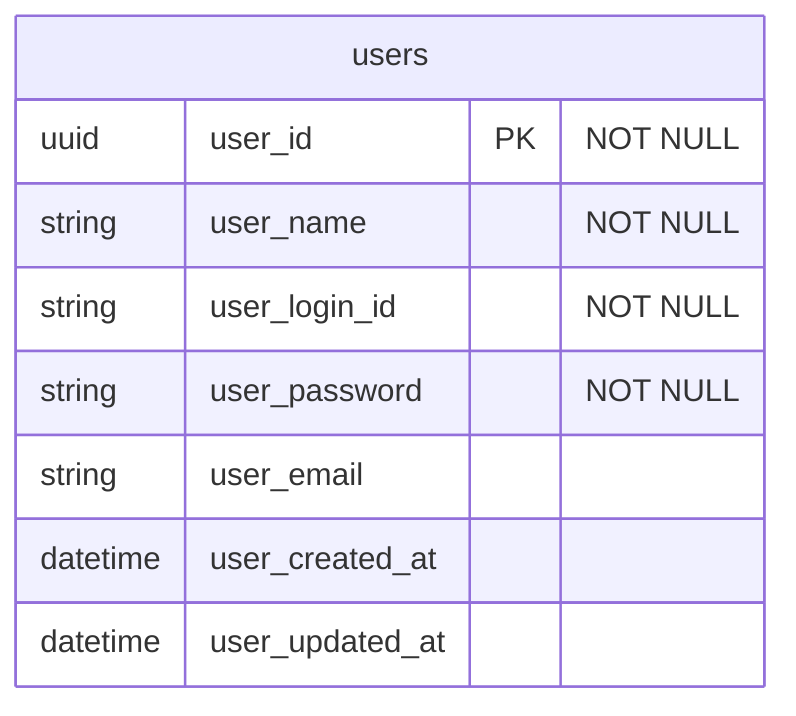
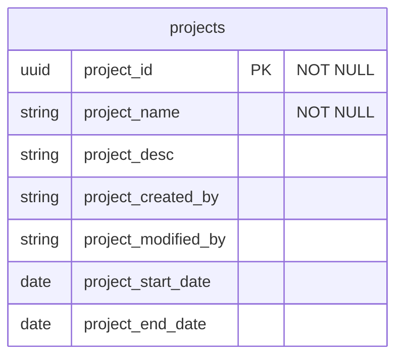
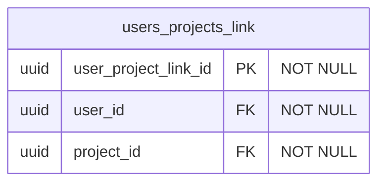
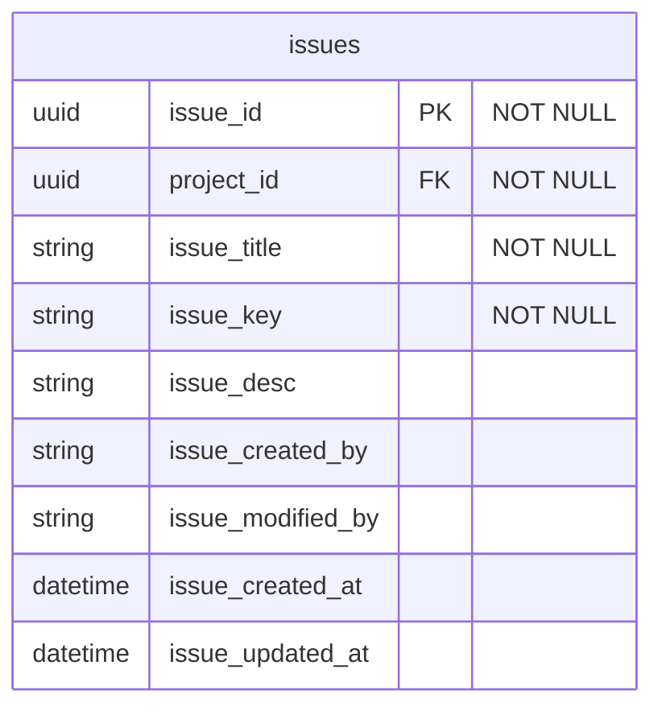
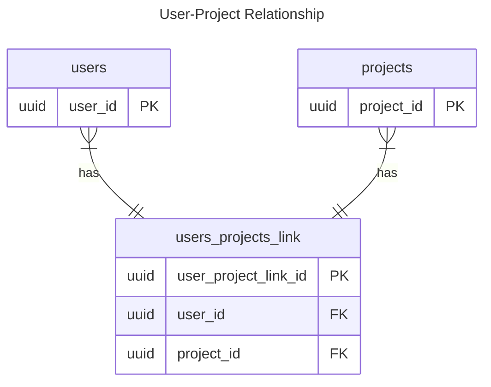
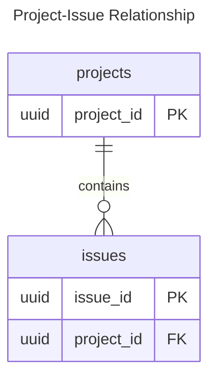

# [Hydra] DB ERD

## Table

### 1. users

```mermaid
erDiagram
    users {
        uuid user_id PK "NOT NULL"
        string user_name "NOT NULL"
        string user_login_id "NOT NULL"
        string user_password "NOT NULL"
        string user_email
        datetime user_created_at
        datetime user_updated_at
    }
```

### 2. projects

```mermaid
erDiagram
    projects {
        uuid project_id PK "NOT NULL"
        string project_name "NOT NULL"
        string project_desc
        string project_created_by
        string project_modified_by
        date project_start_date
        date project_end_date
    }
```

### 3. users_projects_link

```mermaid
erDiagram
    users_projects_link {
        uuid user_project_link_id PK "NOT NULL"
        uuid user_id FK "NOT NULL"
        uuid project_id FK "NOT NULL"
    }
```

### 4. issues

```mermaid
erDiagram
    issues {
        uuid issue_id PK "NOT NULL"
        uuid project_id FK "NOT NULL"
        string issue_title "NOT NULL"
        string issue_key "NOT NULL"
        string issue_desc
        string issue_created_by
        string issue_modified_by
        datetime issue_created_at
        datetime issue_updated_at
    }
```

## Relationships

```mermaid
---
title: User-Project Relationship
---

erDiagram
    users {
        uuid user_id PK
    }

    projects {
        uuid project_id PK
    }

    users_projects_link {
        uuid user_project_link_id PK
        uuid user_id FK
        uuid project_id FK
    }

    users }|--|| users_projects_link : "has"
    projects }|--|| users_projects_link : "has"
```

```mermaid
---
title: Project-Issue Relationship
---
erDiagram
    projects {
        uuid project_id PK
    }

    issues {
        uuid issue_id PK
        uuid project_id FK
    }

    projects ||--o{ issues : "contains"
```
