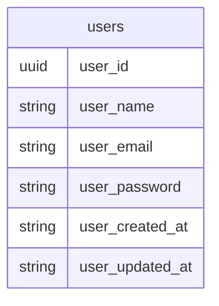
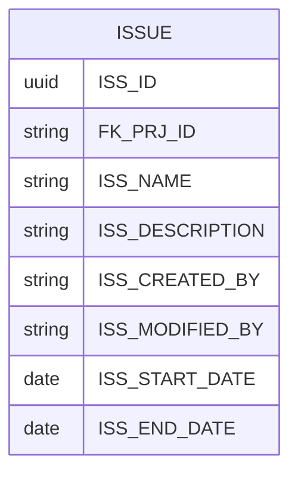
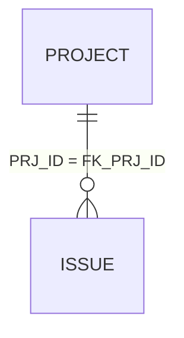

# [Hydra] DB ERD

### 1. users

```mermaid
erDiagram
    users {
        uuid user_id
        string user_name
        string user_email
        string user_password
        string user_created_at
        string user_updated_at
    }
```

### 2. Issue

```mermaid
erDiagram
    ISSUE {
        uuid ISS_ID
        string FK_PRJ_ID
        string ISS_NAME
        string ISS_DESCRIPTION
        string ISS_CREATED_BY
        string ISS_MODIFIED_BY
        date ISS_START_DATE
        date ISS_END_DATE
    }
```

## Table Relation

```mermaid
erDiagram
    PROJECT ||--o{ ISSUE : "PRJ_ID = FK_PRJ_ID"
```
