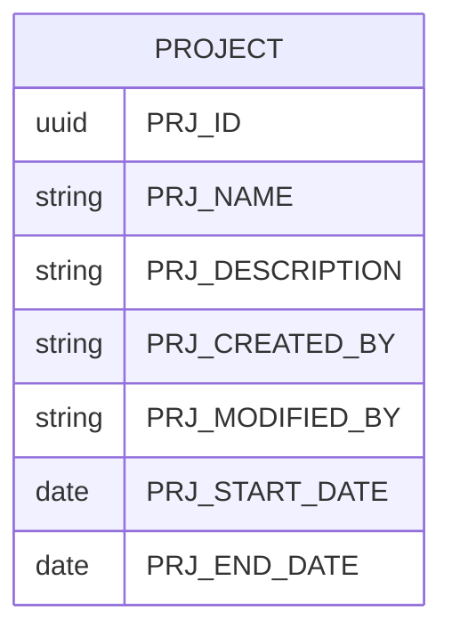
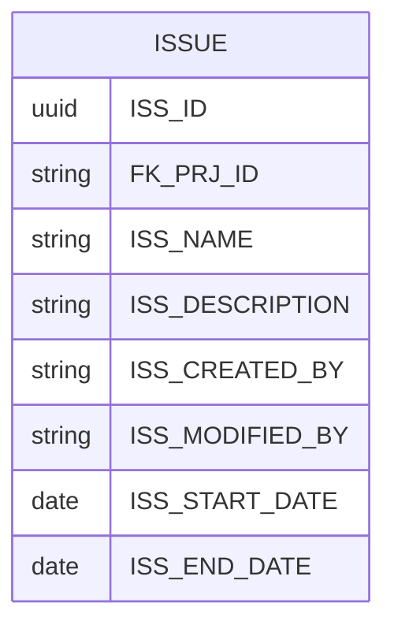
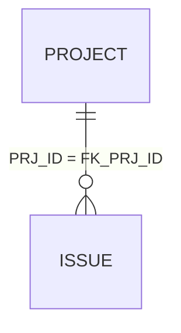

# [Hydra] DB ERD

### 1. PROJECT

```mermaid
erDiagram
    PROJECT {
        uuid PRJ_ID
        string PRJ_NAME
        string PRJ_DESCRIPTION
        string PRJ_CREATED_BY
        string PRJ_MODIFIED_BY
        date PRJ_START_DATE
        date PRJ_END_DATE
    }
```

### 2. Issue

```mermaid
erDiagram
    ISSUE {
        uuid ISS_ID
        string FK_PRJ_ID
        string ISS_NAME
        string ISS_DESCRIPTION
        string ISS_CREATED_BY
        string ISS_MODIFIED_BY
        date ISS_START_DATE
        date ISS_END_DATE
    }
```

## Table Relation

```mermaid
erDiagram
    PROJECT ||--o{ ISSUE : "PRJ_ID = FK_PRJ_ID"
```
