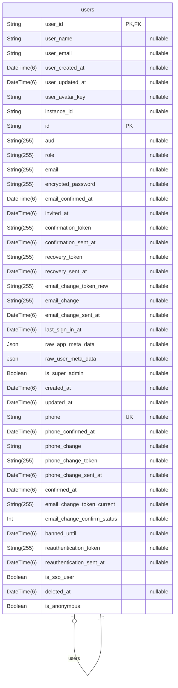
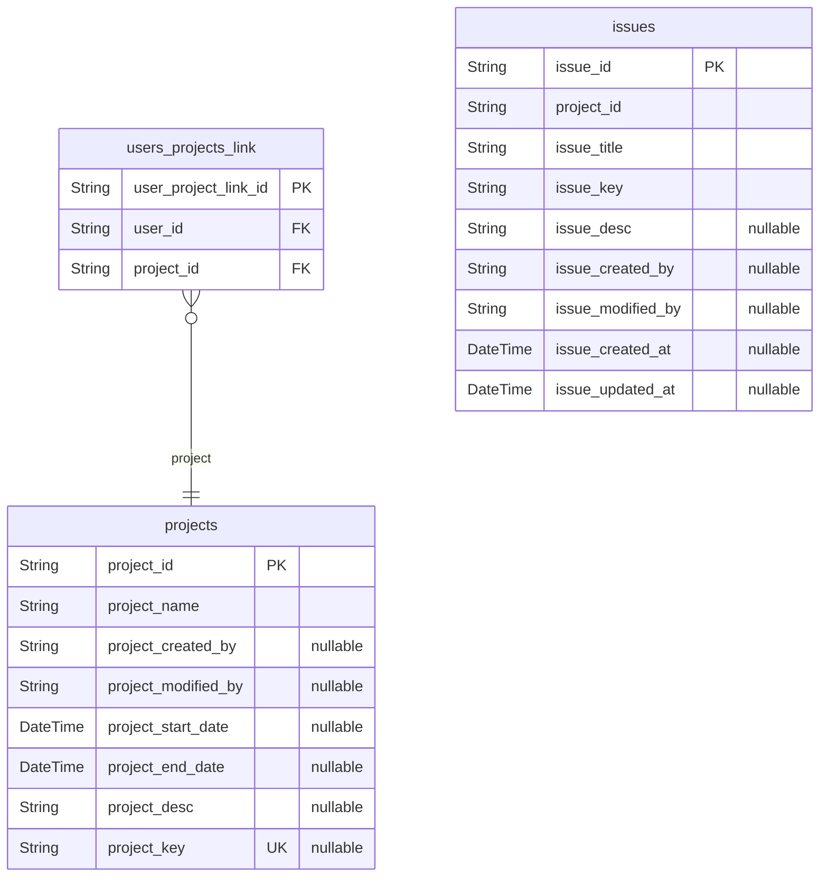
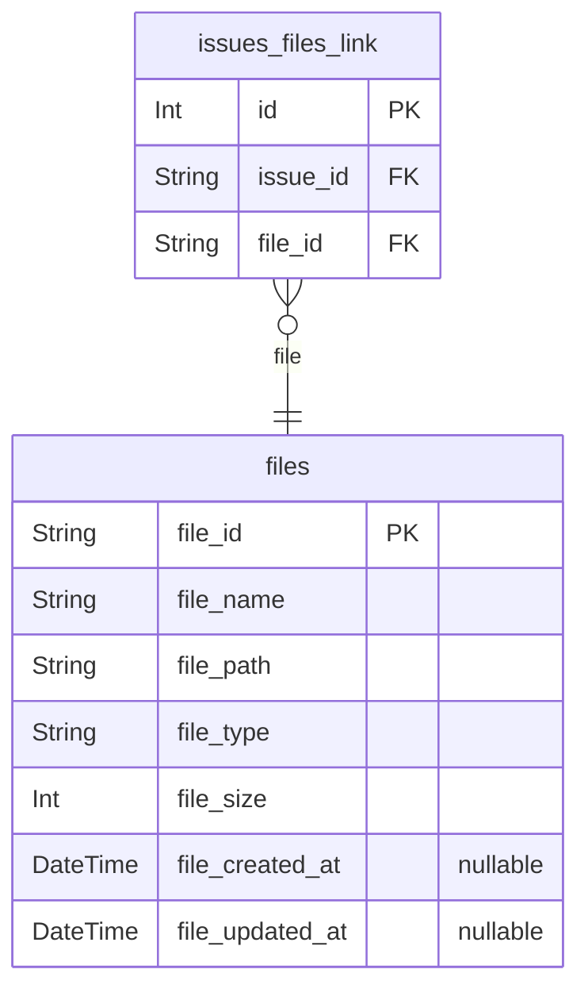

# Hydra ERD
> Generated by [`prisma-markdown`](https://github.com/samchon/prisma-markdown)

- [Auth](#auth)
- [Project](#project)
- [File](#file)

## Auth

### `users`
[auth_users](#auth_users)의 확장 정보를 저장합니다.

**Properties**
  - `user_id`: 
  - `user_name`: 
  - `user_email`: 
  - `user_created_at`: 
  - `user_updated_at`: 
  - `user_avatar_key`: 

## Project

### `projects`
[users](#users)들이 참여하여 [issues](#issues)들을 관리합니다.

**Properties**
  - `project_id`: 
  - `project_name`: 
  - `project_created_by`: 
  - `project_modified_by`: 
  - `project_start_date`: 
  - `project_end_date`: 
  - `project_desc`: 
  - `project_key`: 

### `users_projects_link`

**Properties**
  - `user_project_link_id`: 
  - `user_id`: 
  - `project_id`: 

### `issues`
[projects](#projects)에 속한 이슈들을 관리합니다.

**Properties**
  - `issue_id`: 
  - `project_id`: 
  - `issue_title`: 
  - `issue_key`: 
  - `issue_desc`: 
  - `issue_created_by`: 
  - `issue_modified_by`: 
  - `issue_created_at`: 
  - `issue_updated_at`: 

## File

### `files`

**Properties**
  - `file_id`: 
  - `file_name`: 
  - `file_path`: 
  - `file_type`: 
  - `file_size`: 
  - `file_created_at`: 
  - `file_updated_at`: 

### `issues_files_link`

**Properties**
  - `id`: 
  - `issue_id`: 
  - `file_id`: 