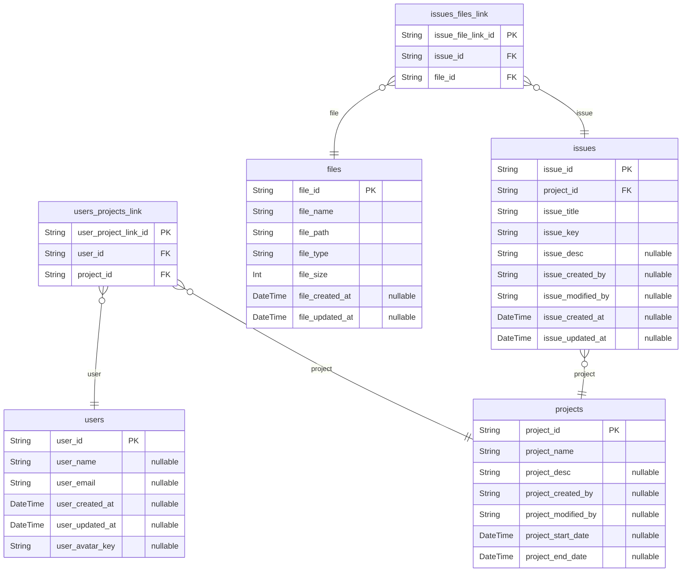
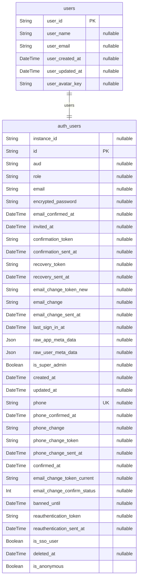
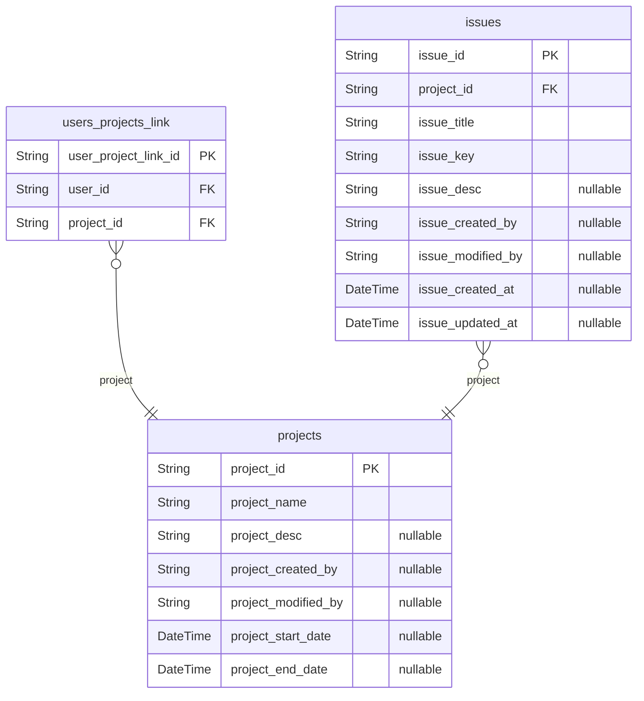
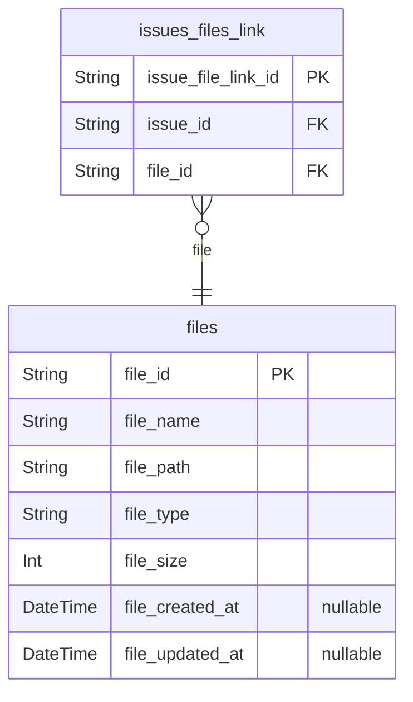

# Hydra ERD

## Overview Diagram

## 1. Auth

### `users`

[auth_users](#auth_users)의 확장 정보를 저장합니다.

**Properties**

- `user_id`:
- `user_name`:
- `user_email`:
- `user_created_at`:
- `user_updated_at`:
- `user_avatar_key`:

## 2. Project Management

### `projects`

[users](#users)들이 참여하여 [issues](#issues)들을 관리합니다.

**Properties**

- `project_id`:
- `project_name`:
- `project_desc`:
- `project_created_by`:
- `project_modified_by`:
- `project_start_date`:
- `project_end_date`:

### `users_projects_link`

**Properties**

- `user_project_link_id`:
- `user_id`:
- `project_id`:

### `issues`

[projects](#projects)에 속한 이슈들을 관리합니다.

**Properties**

- `issue_id`:
- `project_id`:
- `issue_title`:
- `issue_key`:
- `issue_desc`:
- `issue_created_by`:
- `issue_modified_by`:
- `issue_created_at`:
- `issue_updated_at`:

## 3. File Management

### `files`

**Properties**

- `file_id`:
- `file_name`:
- `file_path`:
- `file_type`:
- `file_size`:
- `file_created_at`:
- `file_updated_at`:

### `issues_files_link`

**Properties**

- `issue_file_link_id`:
- `issue_id`:
- `file_id`:
